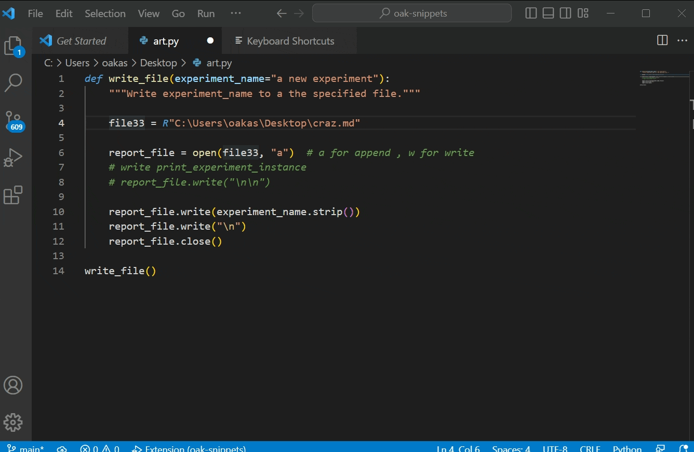
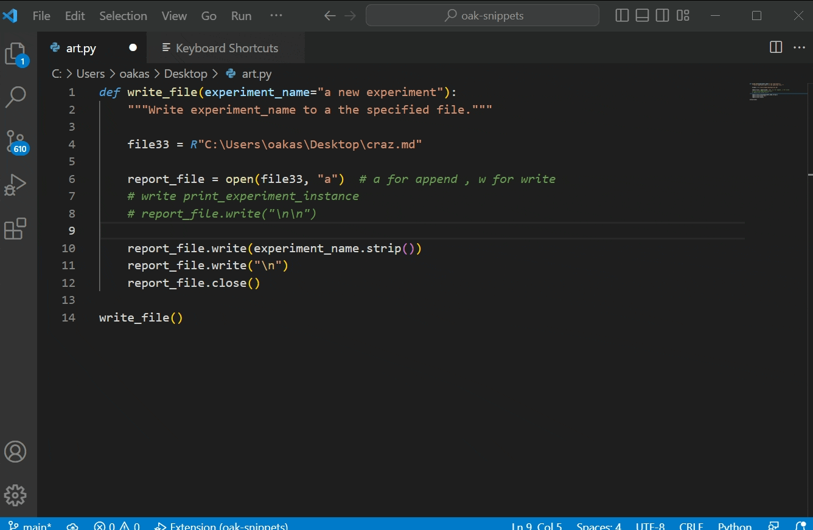
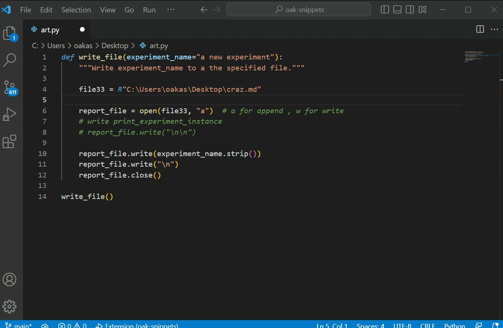
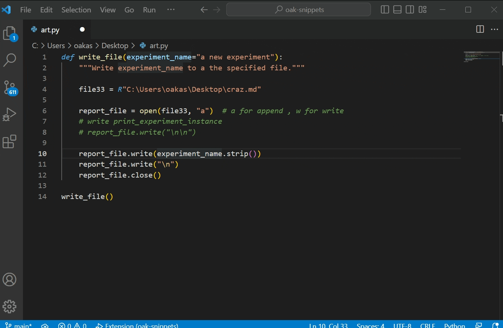

# Incremental Search for Vscode

This extension brings a very basic emacs isearch experience to Vscode.

## What is Incremental Search?

Incremental search is a better find mode than ctrl-F.

Incremental Search

Normal Find

The normal search uses ctrl-F and F3 shortcuts to enter the find mode and
uses enter and shift-enter shortcuts to find the next or previous find matches.

But incremental search uses ctrl-F repeatedly to find next match.
By using incremental search, you build a habit of searching 
the code by find commands, which is a better way to navigate code.

## Story-time

I used emacs editor for a while and get addicted to the incremental search 
feature in it. It helped me on navigating the text files seamlessly. 
It made it a habit for me to use find and search features everywhere.

Even after using Vscode, I could not do without the incremental search feature. 
I tried to find incremental search in many extensions. Most of them are too obtrusive
in the sense that they change the general Vscode experience too much. 
I did want a working, simpler extension.

After 3-4 months of frustration, while I was adding Vscode shortcuts I find the CloseFindWidget and Find Next commands. I figured out that I can create a basic
incremental search just by creating three more keybindings. Then I bind those
shortcuts. I have been very content while I have been using them.
Today I figured out that I can also ship those changes as a Vscode extension.

## Use cases

This extension defines three shortcuts.

Ctrl-f after the first Ctrl-f is bound to Find Next command.

Repeatedly press Ctrl-f to move on to the next find match.

To quit the find prompt, use the right and left arrow keys.

## Getting Started

There are not any settings in the extension.

Installing the extension will load shortcuts automatically.

In order to disable the shortcuts, disable the extension.

## Replicating the Experience Without Installing the Package

You can replicate the experience by creating keyboard shortcuts manually.
You can get the names of the shortcuts from the Feature Contributions tab. 

To create shortcuts manually:

Press Ctrl-Shift-p to run the command "Preferences: Open Keyboard Shortcuts"
or use the shortcut (Ctrl-k Ctrl-s)

After opening keyboard shortcuts

Bind C-f to Find Next

(Inherit it from <enter> Find Next)

Bind leftArrow to closeFindWidget

Bind rightArrow to closeFindWidget

(Inherit those from <escape> closeFindWidget keys)

## GitHub Link

[Incremental Search for Vscode on Github](https://github.com/oakasapoglu/incremental-search-for-vscode)
